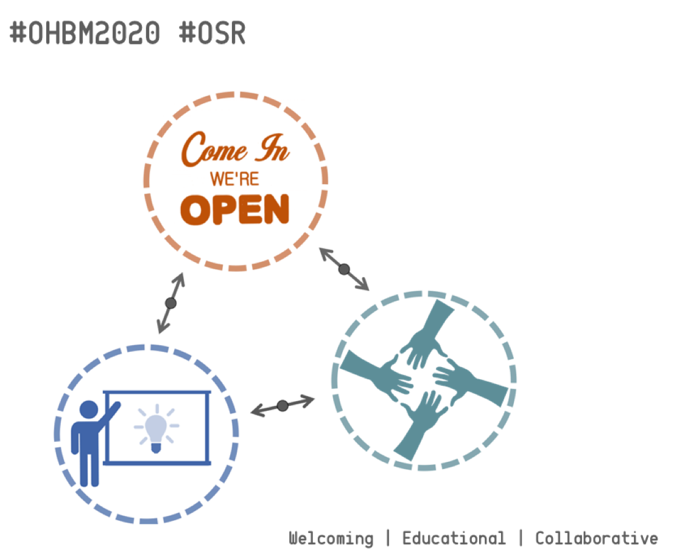
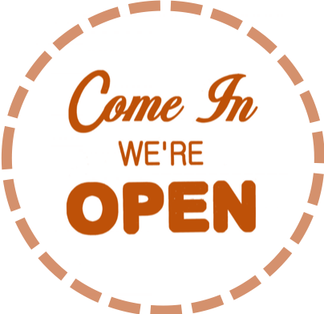
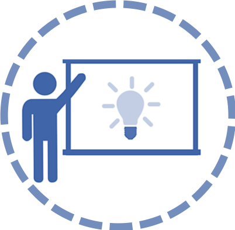
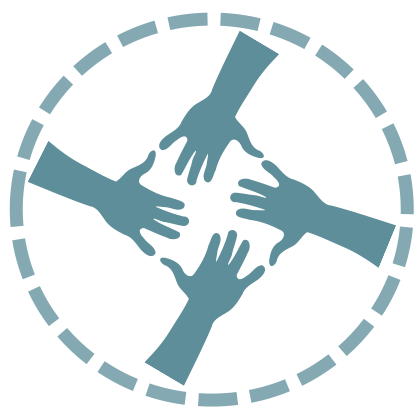
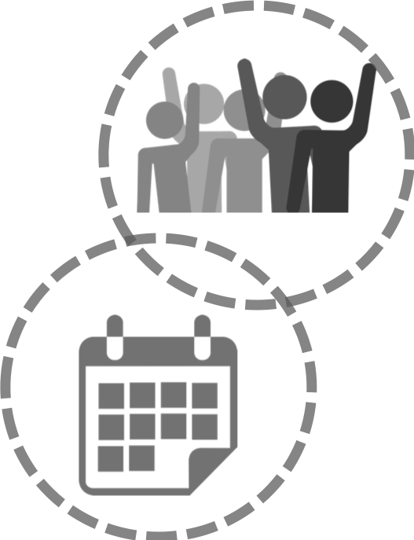
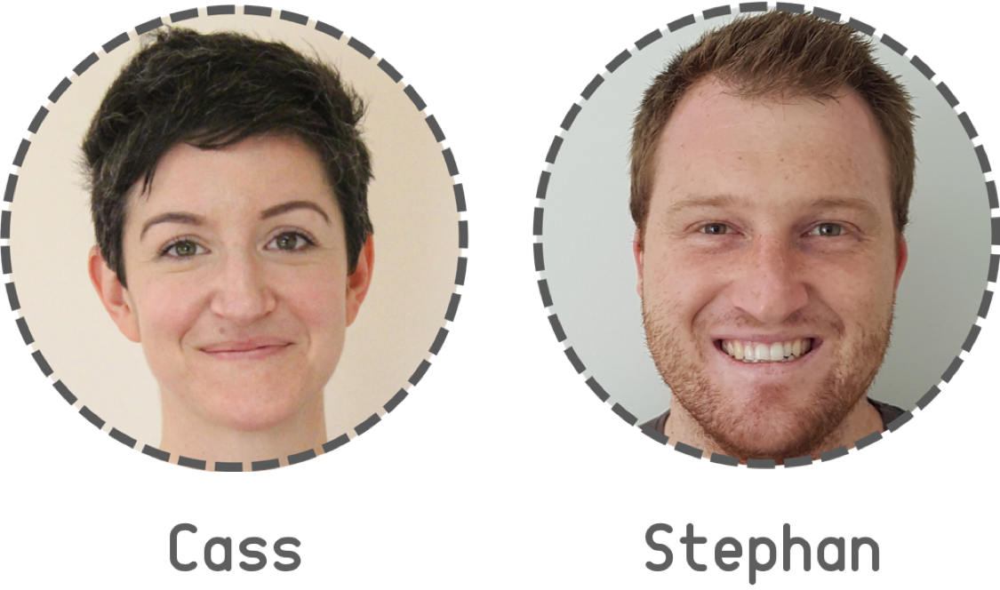
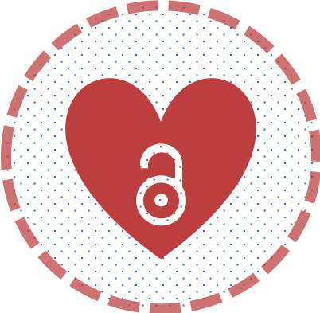

# Cassandra Gould van Praag and Stephan Heunis
## Nominated Chairs' Vision for OHBM 2020 Open Science Room

The [open science room](https://ossig.netlify.com) (OSR) has always been the highlight of our [OHBM](https://www.humanbrainmapping.org/i4a/pages/index.cfm?pageid=3267&pageid=1) conference experience. Next year we'd like to give something back to the community, and offer you a well structured OSR which works hard to support every stage of your open science journey.

## Welcoming!

All community members should feel invited, welcomed and included in the OSR. To promote an inclusive space, we would create a welcoming entry point that attracts the eye of passers-by. This welcoming space will:
  * Give a visual introduction to what open science can bring to your research
  * Demonstrate how the OSR fits into the conference and OHBM community
  * Give an easy overview of the OSR schedule
  * Offer you a piece of fruit?!

## Educational!

Open science can be hard. So many tools to learn, so many practices to be aware of! We want to support a growth mindset in the OSR, where we all understand that effort and failure can make us stronger together, whatever our starting point. Educational sessions held in and around the OSR could take the form of:

  * Talks
  * Software demos
  * Round-table discussions
  * Workshops
  * Hands-on tutorials
  * Drop-ins or "Office Hours"
  * Spontaneous [teach-ins](https://en.wikipedia.org/wiki/Teach-in)!

Importantly, we want to facilitate a continuous learning experience between the OHBM [Hackathon](https://hackathon.guide), the OHBM Educational Day, the OHBM oral sessions/symposia and the OSR. This will require good coordination and close attention to issues or opportunities for learning which arise. We're totally down with that.

## Collaborative!

Open science is about working together for the benefit of all. We want to create a space where collaboration can flow when and how you want it to. This includes creating room for:

  * Impromptu discussions
  * Breakout sessions for workshopping (with white boards!)
  * Advertising collaboration opportunities or offers of support
  * Working on your own, but together (tables, chairs, beanbags, plug sockets...)

## You do you, we’ll sort the rest!

To support all of the above, we want to put a structure in place that removes barriers and helps you make the most of your time in the OSR. You shouldn't have to be confused about what to sign up for, where to go, what to take part in. We're thinking:

  * Easy access to the daily schedule at a glance, online and in person around the OSR
  * A quick and easy way to self-organise sessions
  * Dedicated areas for impromptu discussions
  * Workshops and brain-storming spaces
  * A chilled vibes work space
  * Refreshments!

We'll take continuous input and contributions from the whole community, to keep the OSR fluid and reactive to the larger conference. If you feel like sharing ideas and contributing your skills, we'd love you to do so! We'll have clear communication channels and always have someone on hand to answer questions or make introductions.

## Who are we?!

### Cassandra Gould van Praag

Cass is a postdoctoral researcher at the University of Oxford Department of Psychiatry. She provides support for (f)MRI experimental design and analysis in the investigation of treatments for mood disorders. In this role she has to stay up to speed with the leading edge of analytic tools, and is constantly on the look out for tips, tricks and techniques to make this research quicker, slicker, and more effective. This goes hand-in-hand with making the research more transparent and reproducible, and freely sharing the outputs of our labour. She is a contributor to [The Turing Way](https://the-turing-way.netlify.com/introduction/introduction) and works with the [Wellcome Centre for Integrative Neuroimaging Open Community Team](https://www.win.ox.ac.uk/open-neuroimaging/open-neuroimaging-project). She is a passionate believer in accessibility and the equitable dissemination of knowledge, and spends a lot of time showing people that programming isn't scary.

Cass' has professional experience in coaching, group facilitation, team management, and project management. She is fiercely brave, and great at organising a party.

twitter: [@cassgvp](https://twitter.com/cassgvp) | github: [@cassgvp](https://github.com/cassgvp) | [OSF](https://osf.io/7s93g/) | [University page](https://www.psych.ox.ac.uk/team/cassandra-gould-van-praag) | [Research gate](https://www.researchgate.net/profile/Cassandra_Gould_Van_Praag) | A [blog post](https://www.ohbmbrainmappingblog.com/blog/open-science-as-social-justice) Cass wrote about open science | What Cass' [parties](https://www.mariannechua.com/cass-and-chris-ultimate-diy-festival-wedding-with-a-woodland-song-tastic-ceremony/) look like

### Stephan Heunis

Stephan is a researcher and PhD candidate at the Electrical Engineering department of the Eindhoven University of Technology in the Netherlands. His research focuses on developing new acquisition and signal processing methods for functional neuroimaging that allow the real-time tracking and visualisation of distributed MRI brain activity patterns. Stephan is passionate about making research and scientific practice more transparent, rigorous and inclusive. He started the [Open Science Community Eindhoven](https://osceindhoven.github.io/), which is part of a wide Dutch network of researchers and university employees that focuses on improving scientific practice. He is also the founder of [OpenMR Benelux](https://openmrbenelux.github.io/), a community working on wider adoption of open science principles in MRI research through talks, discussions, workshops and hackathons.

Stephan is very experienced in reproducible working practices and has an excellent track record organising open community events. He is considerate and compassionate, and only breaks git sometimes.

twitter: [@fmrwhy](https://twitter.com/fmrwhy) | github: [@jsheunis](https://github.com/jsheunis) | [Website and blog](https://www.fmrwhy.com/) | [University page](https://research.tue.nl/en/persons/js-stephan-heunis)

## What a team!

We are both passionate about creating opportunities to facilitate excellent open science in our community. We see a future where open science practices are the norm, and we want to help everyone make the transition as smoothly as possible, starting with solutions to whatever transparency/reproducibility/inclusivity/educational/collaborative problems you are faced with right now.

We decided to run together for this post because team work makes the dream work. We feel strongly that our unique contributions to organising the OSR will produce a more productive, inspiring and inclusive space, and we want to show you how well the core tenant of collaboration in open science can work in practice. We'll learn from each other along the way, and produce something beautiful.
