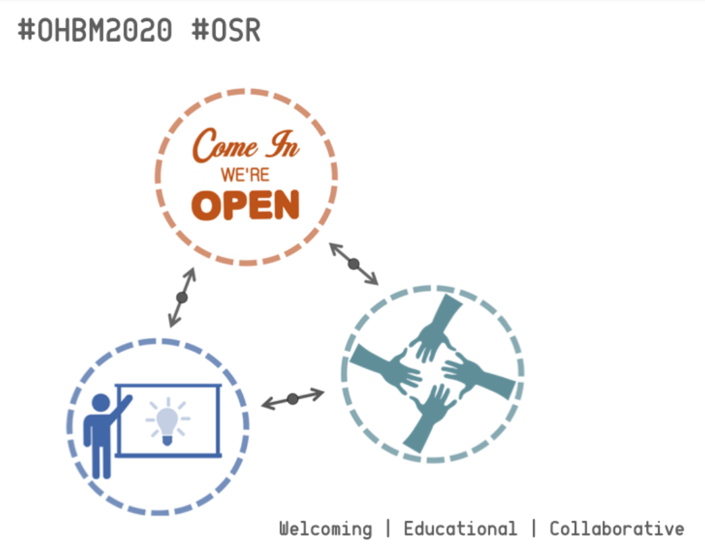

# Cass Gould van Praag and Stephan Heunis for OHBM 2020 Open Science Room Chairs

## Pictures are nice, but we want to see action!

We’ve thought long and hard about what we’d like to bring to you in the open science room (OSR) for 2020. These ideas build on the excitement we’ve felt at OHBM in years passed, but go one stage further in delivering a well communicated structure which works for all of us.

## Welcoming!

All society members should feel invited, welcomed, and included in the OSR, not just the "open science crowd". To promote an inclusive space, we would create a welcoming entry point into the open science area. A visible point that attracts the eye of passers-by. A space that:
  * Gives an accessible low-down of what the OSR is all about;
  * Tells you what to expect;
  * Offers you a piece of fruit;

## Educational!

Open science is hard sometimes. So many tools to learn, so many practices to be aware of, so little time. Providing a space and framework for this learning is core to the OSR. We want to make open science accessible to all, from newbies to experts. Let's learn together! Educational sessions could take the form of:

  * Talks
  * Software demos
  * Round-table discussions
  * Workshops
  * Hands-on tutorials
  * Drop-ins
  * Hackathon “Traintrack”

Importantly, we want to facilitate a continuous learning experience between the OHBM hackathon, the OHBM educational day, the OHBM oral sessions/symposia and the OSR. This will require good coordination, which we're totally down with!

## Collaborative!

Open science is about working together for the benefit of all. We want to create a space where collaboration can flow when and how you want it to. This includes creating room for:

  * Impromptu discussions
  * Breakout sessions for workshopping (with white boards!)
  * Working on your own, but together (tables and chairs, basically :D)

Critical thinking and open discourse are super important, especially when it comes to controversial topics or some of our core assumptions. Why not create collaborative learning sessions out of this? We're aiming to build further on the successes of #OHBM2019 impromptu discussions. Let's collaborate and educate to drive our field forward!

## You do you, we’ll sort the rest!
 
To support all of the above, we want to put a structure in place that removes barriers so that you can get the most out of your time in the OSR. You shouldn't have to be confused about what to sign up for, where to go, what to take part in. We're thinking:

  * easy access to the daily schedule at a glance, online and in person around the OSR
  * quick and easy way to self-organise sessions
  * dedicated areas for impromptu discussions
  * workshops and brain-storming spaces
  * a chill-out space
  * refreshments!
 
Of course, "we'll sort the rest" includes getting continuous input and contributions from the whole society. If you feel like sharing ideas and contributing your skills, please do so! It's not just us, it's all of us!

## Who are we?! 

### Cass

...

### Stephan

...
